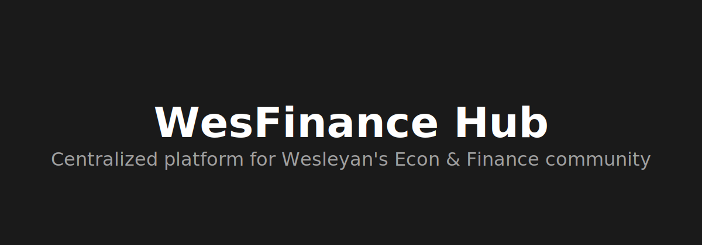
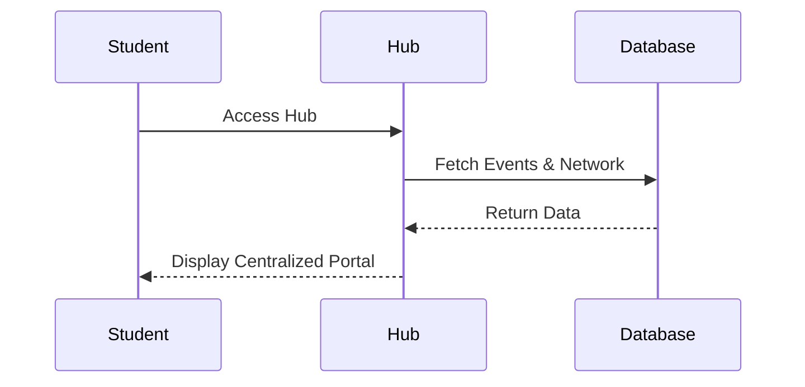

<picture>
  <source media="(prefers-color-scheme: dark)"  srcset="assets/banner-dark.svg">
  <source media="(prefers-color-scheme: light)" srcset="assets/banner-light.svg">
  
</picture>

## Architecture

## Setup
(To be written after architecture decision)

## License
[MIT License](#license)
