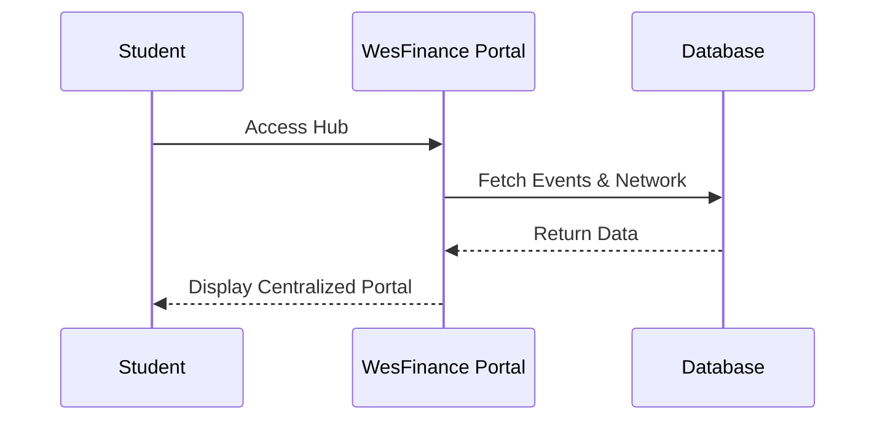

# WesFinance Hub

> **Community portal and event network for Economics and Finance at Wesleyan University.**

## 💡 What is WesFinance Hub?

Navigating career recruiting, alumni networking, guest speaker events, and club activities in finance and economics often involves scattered email threads and multiple separate student organizations.

WesFinance Hub centralizes all campus finance activities into a single student portal. Students can discover upcoming finance workshops, connect with alumni mentors on Wall Street and in consulting, access interview prep materials, and stay updated on student investment fund meetings.

## Architecture

```mermaid
sequenceDiagram
    participant Student
    participant Hub as WesFinance Portal
    participant Database
    
    Student->>Hub: Access Hub
    Hub->>Database: Fetch Events & Network
    Database-->>Hub: Return Data
    Hub-->>Student: Display Centralized Portal
```

## Setup

(To be written after architecture decision)

## License

[MIT License](#license)
